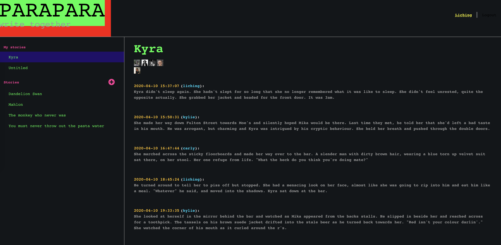

# parapara
a fun hack for friends in isolation to write stories together during covid-19



### Prerequisites
- [google auth - credential setup](https://console.developers.google.com)
- [awscli](https://aws.amazon.com/cli/)
- [npm](https://www.npmjs.com/get-npm)

## Development
This app has
- a webapp built in React bootstrapped from create-react-app
- a server built with node and express
- a local dynamo db

This app can be built and run, with or without docker.

#### With Docker
- Dependencies
  - docker


- Start local dev env
    - `auto/start`


- Set up dynamodb tables
    - `auto/create-db-tables`


- Navigate to http://localhost:3000


#### Without Docker
  ###### Setup
  - configure aws
      ```
      > aws configure
      AWS Access Key ID: foo
      AWS Secret Access Key: bar
      Default region name: localhost
      Default output format: json  
      ```
    - setup dynamodb `auto/setup-dynamodb-local`
    - create tables `auto/create-db-tables`
    - kill session

###### Run app:
  - start dynamodb 
    - `auto/start-db` (port 8000)


  - start client
    - `auto/start-client`


  - start server
    - `auto/start-server` (port 5000)


  - Navigate to http://localhost:3000
